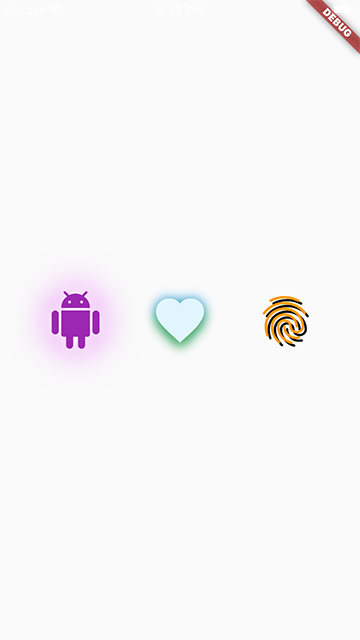

[](https://pub.dev/packages/decorated_icon)

# Decorated Icon

The best-performing shadowed icon widget for Flutter!

`DecoratedIcon` is a super lightweight Icon widget that supports shadow decorations. With no complicated hacks or multiple widgets, and with only a single dozen of code lines, the shadows are applied to the icon as perfectly as they would be applied to a `Text` widget.

This widget is able to achieve the most efficient, most flexible implementation of an icon with a shadow because it is using a single `Text` widget to display the icon and apply the shadows to it.

One thing to keep in mind when using multiple shadows is the order of stacking of the shadows by Flutter; the first shadow in the list will be painted at the bottom. (Similar to how the [Stack](https://api.flutter.dev/flutter/widgets/Stack-class.html) widget draws its children.)

Also note that due to Flutter's current limitation, achieving an **Outer Glow** effect is not currently possible. You can follow more [here](https://github.com/flutter/flutter/issues/65763).


## Usage

To use this package, add `decorated_icon` as a [dependency in your pubspec.yaml file](https://flutter.io/using-packages/).

## Example



Import the library.

``` dart
import 'package:decorated_icon/decorated_icon.dart';
```

Then use `DecoratedIcon` as you would any other widget:
```dart
Scaffold(
  body: Center(
    child: Row(
      mainAxisAlignment: MainAxisAlignment.spaceEvenly,
      children: [
        DecoratedIcon(
          Icons.android,
          color: Colors.purple,
          size: 60.0,
          shadows: [
            BoxShadow(
              blurRadius: 42.0,
              color: Colors.purpleAccent,
            ),
            BoxShadow(
              blurRadius: 12.0,
              color: Colors.white,
            ),
          ],
        ),
        DecoratedIcon(
          Icons.favorite,
          color: Colors.lightBlue.shade50,
          size: 60.0,
          shadows: [
            BoxShadow(
              blurRadius: 12.0,
              color: Colors.blue,
            ),
            BoxShadow(
              blurRadius: 12.0,
              color: Colors.green,
              offset: Offset(0, 6.0),
            ),
          ],
        ),
        DecoratedIcon(
          Icons.fingerprint,
          color: Colors.orange,
          size: 60.0,
          shadows: [
            BoxShadow(
              color: Colors.black,
              offset: Offset(3.0, 3.0),
            ),
          ],
        ),
      ],
    ),
  ),
);
```